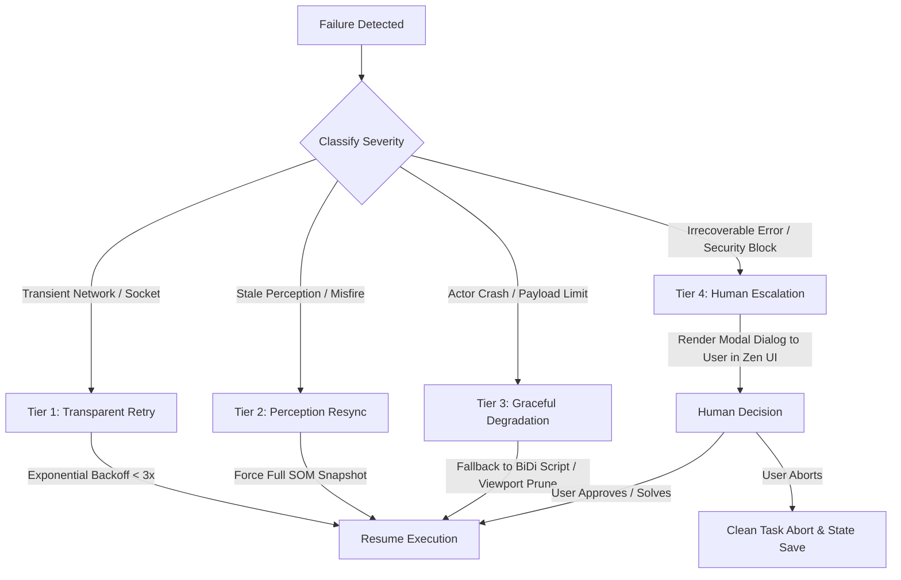

# ADR-0010: Failure Taxonomy, Degradation Modes, and Recovery Architecture

## Status
**ACCEPTED (Structured State-Machine Failure Hierarchy & Recovery Protocol)**

---

## Context
Autonomous and semi-autonomous browser agents operate in a fundamentally hostile and nondeterministic runtime environment. Websites crash, network connections drop, single-page apps dynamically replace DOM hierarchies during clicks, browser processes run out of memory, and LLMs hallucinate malformed parameters.

To ensure production resilience, the Agentic Browser must establish an exhaustive failure taxonomy, define automated recovery protocols, and determine when human intervention is required.

---

## Failure Taxonomy & Recovery Protocol Matrix

| Failure Class | Root Cause | Detection Mechanism | Recovery Possibility | Retained State Required | Human Confirmation Required? |
| :--- | :--- | :--- | :---: | :--- | :---: |
| **1. Browser Crash** | Gecko/Zen SIGSEGV, OS out-of-memory (OOM), GPU driver crash. | OS process exit code, BiDi WebSocket sudden TCP disconnect. | **Automatic** | Persistent Agent Task Plan, scratchpad, visited URLs, uncommitted form inputs. | **No** (Automatic browser restart and session restore). |
| **2. BiDi Disconnect** | Socket termination, port collision, or local network stack reset. | WebSocket `onclose` or `onerror` event within agent sidecar. | **Automatic** | Last known BiDi command ID, target context mapping. | **No** (Reconnect with exponential backoff up to 3 retries). |
| **3. Context Destruction** | User closes tab, web page calls `window.close()`, or navigation aborts. | BiDi `browsingContext.contextDestroyed` event; HTTP 404/invalid context errors on command dispatch. | **Conditional** | Agent parent task goal, origin URL. | **No** (If tab was auxiliary; re-open tab); **Yes** (If user explicitly closed active target tab). |
| **4. Stale Perception (Action Misfire)** | Element mutated or moved between perception capture and action dispatch (`somId` missing). | Action failure with element not found; or click coordinates hit wrong element. | **Automatic** | Agent goal, previous action attempt counter. | **No** (Trigger forced authoritative SOM re-snapshot and re-plan, max 3 attempts). |
| **5. Actor Failure (IPC Timeout)** | `JSWindowActorChild` hangs on infinite regex or complex DOM traversal. | IPC timeout timer (default: 500 ms) expires in parent actor. | **Automatic** | Context ID, fallback flag. | **No** (Fallback to BiDi `script.evaluate` extraction; log warning). |
| **6. Oversized Payload (> 1 MB)** | Page DOM contains tens of thousands of nodes (e.g. 50 MB table or infinite feed). | In-process size counter exceeds 1 MB before serialization. | **Automatic** | Current viewport bounding box. | **No** (Apply aggressive viewport-only clipping; prune all offscreen nodes). |
| **7. Navigation Failure** | DNS resolution error, HTTP 500/502/503, SSL certificate error, connection timeout. | BiDi `browsingContext.navigationFailed` event; HTTP error status code. | **Conditional** | Target URL, navigation attempt count. | **No** (Retry up to 2 times for transient errors); **Yes** (For persistent 404 or SSL security errors). |
| **8. Action Failure** | Target button disabled (`disabled="true"`), covered by modal overlay, or pointer intercepted. | DOM event bubbling listener reports no trigger, or BiDi returns `element click intercepted`. | **Automatic** | Failed element `somId`, modal detection heuristic. | **No** (Inspect for blocking modal dialogs / cookie banners; dismiss banner and retry). |
| **9. Agent Runtime Crash** | External sidecar process crashes due to unhandled node/rust exception. | OS systemd / launchd / Windows Service Manager watchdog. | **Automatic** | Disk-persisted SQLite / JSON WAL log of agent plan and state. | **No** (Daemon restarts, reads WAL log, re-attaches to live Zen browser). |
| **10. Malformed Model Output** | LLM outputs invalid JSON, non-existent tool names, or hallucinated `somId` strings. | JSON Schema validator / Zod parser in Agent Reasoning Core. | **Automatic** | Conversation history, schema error description. | **No** (Inject schema validation error into agent prompt as system feedback; retry generation). |

---

## Degradation & Resilience Tiers

---

## State Retention & Persistence Invariants

To guarantee that agent tasks survive browser restarts or machine sleeps, the Agent Runtime must maintain a deterministic **Write-Ahead Log (WAL)** persisted to local disk (e.g. SQLite database):
1. **The Task Contract:** User prompt, high-level goal, and constraints.
2. **The Plan State:** Sequence of planned sub-tasks, completion status, and active sub-goal.
3. **The Observation History:** Truncated summary of previous actions taken, key page titles, and extracted data.
4. **Form Stash Memory:** Any text input typed into web forms by the agent, so that if the page reloads, inputs can be re-populated without hallucination.

---

## Human Escalation Gates (Human-in-the-Loop)

Under no circumstances should the agent attempt automated recovery loops indefinitely. An automated action will halt and escalate to a human user when:
1. **CAPTCHA / Bot Detection:** Cloudflare turnstile, reCAPTCHA, or bot-block screen is detected on navigation.
2. **Persistent Action Failures:** An action fails 3 consecutive times after perception resynchronization.
3. **Destructive Ambiguity:** A navigation or click action cannot be disambiguated and carries a risk of permanent state deletion.
4. **Financial / High-Risk Operations:** Reached checkout, money transfer, or administrative settings deletion.

---

## Validation Requirements for Phase 1
1. Build a synthetic "Chaos Test" suite: simulate random WebSocket drops, content process kills (`kill -9`), and DOM element removal during click dispatch.
2. Verify that the WAL persistence layer resumes an in-progress workflow with zero lost tasks after a forced `SIGKILL` of the agent process.
