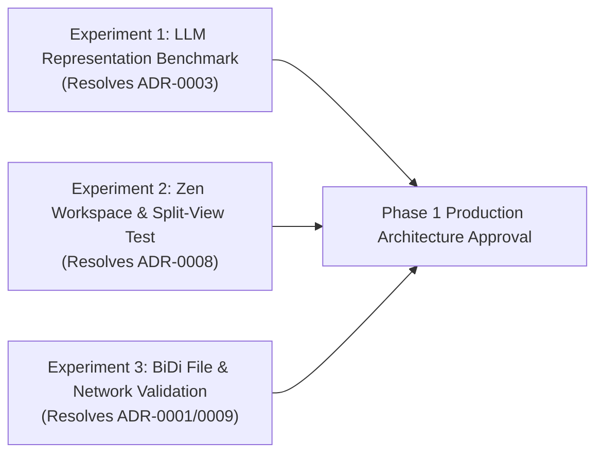

# Phase 0.3 Architecture Decision Summary & Governance Report

**Project:** Agentic Browser  
**Author:** Principal Software Architect & Research Engineering Team  
**Date:** 2026-09-24  
**Status:** Comprehensive Governance & ADR Baseline  
**Base Commit (Zen Desktop):** `4c92731b2dbbcf3f5a4dad79c09d13c38f91f774`  
**Phase 0.2 Baseline Commit:** `c20c176`  

---

## Executive Summary

Phase 0.3 converts the empirical research baseline from Phase 0, Phase 0.1 (Zen Source Audit), and Phase 0.2 (Perception & Actuation Benchmark) into **ten formal Architectural Decision Records (ADRs)**. 

Rather than adopting generic architectural assumptions or premature design patterns, each architectural boundary is classified under strict empirical criteria:
- **`OBSERVED`**: Directly verified in official Zen Browser source code or upstream Gecko architecture.
- **`MEASURED`**: Empirically measured in live browser testing with quantitative datasets.
- **`INFERRED`**: Logical deductions derived directly from measured data.
- **`UNKNOWN`**: Areas lacking empirical verification that are formally deferred.

---

## 1. Current Architectural Model

The verified baseline architecture for the Agentic Browser is established as a **Dual-Plane Hybrid Architecture**:

```
+---------------------------------------------------------------------------------+
|                               HOST OPERATING SYSTEM                             |
|                                                                                 |
|  +---------------------------------------------------------------------------+  |
|  |                EXTERNAL LOCAL AGENT RUNTIME (Dedicated Sidecar)           |  |
|  |                                                                           |  |
|  |  +-------------------------+      +------------------------------------+  |  |
|  |  |   Agent Reasoning Core  |      |   Write-Ahead Log (WAL / SQLite)   |  |  |
|  |  |   (LLM, Tools, Memory)  |      |   (Crash Recovery & Task State)    |  |  |
|  |  +------------+------------+      +-----------------+------------------+  |  |
|  |               |                                     |                     |  |
|  |  +------------v-------------------------------------v------------------+  |  |
|  |  |          STRUCTURAL POLICY ENGINE (Kernel-Style Gate)                |  |  |
|  |  |      - Autonomous vs Guarded vs Human-in-the-Loop Actions            |  |  |
|  |  |      - Ephemeral 256-bit Loopback Token Authorization                |  |  |
|  |  +------------+-------------------------------------+------------------+  |  |
|  +---------------|-------------------------------------|---------------------+  |
|                  | (BiDi WebSocket)                    | (Perception Bridge)    |
|                  | 127.0.0.1:<port>/session            | Loopback IPC/WebSocket |
|                  |                                     |                        |
|  +---------------v-------------------------------------v---------------------+  |
|  |                          ZEN BROWSER PROCESS                              |  |
|  |                                                                           |  |
|  |  +-----------------------------+      +--------------------------------+  |  |
|  |  |  Gecko WebDriver BiDi       |      |  Zen Chrome Parent Process     |  |  |
|  |  |  (Upstream Remote Module)   |      |  src/zen/agent/AgentActorsParent|  |  |
|  |  +--------------+--------------+      +---------------+----------------+  |  |
|  |                 |                                     |                   |  |
|  |                 | (Synthetic Input & Contexts)        | (JSWindowActor IPC|  |  |
|  |                 |                                     |  < 100 KB deltas) |  |
|  |  +--------------v-------------------------------------v----------------+  |  |
|  |  |           UNPRIVILEGED CONTENT PROCESS (Site Isolation)             |  |  |
|  |  |                                                                     |  |  |
|  |  |   +-------------------------------------------------------------+   |  |  |
|  |  |   |  AgentActorsChild.sys.mjs                                   |   |  |  |
|  |  |   |  - In-Process Credential Redactor (Zero-Leakage Invariant)  |   |  |  |
|  |  |   |  - Visibility & Geometry Pruner                             |   |  |  |
|  |  |   |  - Debounced MutationObserver (50ms Delta Stream)           |   |  |  |
|  |  |   +------------------------------+------------------------------+   |  |  |
|  |  |                                  |                                  |  |  |
|  |  |   +------------------------------v------------------------------+   |  |  |
|  |  |   |  Document Object Model (DOM) & Layout Engine (Gecko)         |   |  |  |
|  |  |   +-------------------------------------------------------------+   |  |  |
|  |  +---------------------------------------------------------------------+  |  |
|  +---------------------------------------------------------------------------+  |
+---------------------------------------------------------------------------------+
```

---

## 2. Status of Architectural Decisions

### A. Decisions Accepted (Backed by Empirical Research)

1. **[ADR-0001: Browser Control Plane Interface](file:///c:/Users/saisa/Documents/Work/Projects/Personal/Agentic-Browser/research/adr/ADR-0001-browser-control-plane.md) — ACCEPTED**
   - **Decision:** Adopt upstream W3C WebDriver BiDi as the standard external control plane for context creation, lifecycle, navigation, synthetic hardware input, and screenshots.
   - **Empirical Rationale:** Sub-10ms actuation latency (click P50 = 5.40 ms), native integration into Gecko without modifying Zen C++ source, 100% test reliability over 100 trials.
2. **[ADR-0002: In-Process Semantic Perception via JSWindowActor](file:///c:/Users/saisa/Documents/Work/Projects/Personal/Agentic-Browser/research/adr/ADR-0002-in-process-perception.md) — ACCEPTED**
   - **Decision:** Implement browser perception in-process using Gecko `JSWindowActor` (`AgentActorsChild` $\leftrightarrow$ `AgentActorsParent`).
   - **Empirical Rationale:** Sub-millisecond DOM extraction (0.42–1.05 ms); sub-5ms IPC round-trip for payloads $\le 100\text{ KB}$; strictly caps messages to $< 1\text{ MB}$ to eliminate UI thread jank.
3. **[ADR-0004: Perception Update Strategy](file:///c:/Users/saisa/Documents/Work/Projects/Personal/Agentic-Browser/research/adr/ADR-0004-incremental-perception.md) — ACCEPTED (Hybrid Model)**
   - **Decision:** Full authoritative snapshot on initial navigation; 50 ms debounced incremental delta streaming during interactive editing; threshold-based authoritative reconciliation to prevent drift and mutation storms.
   - **Empirical Rationale:** 65.95% to 74.37% payload savings measured on mutation events; prevents out-of-order state drift.
4. **[ADR-0005: Agent Runtime Process Boundary](file:///c:/Users/saisa/Documents/Work/Projects/Personal/Agentic-Browser/research/adr/ADR-0005-agent-runtime-boundary.md) — ACCEPTED**
   - **Decision:** Host the Agent Runtime in a dedicated external local daemon (Sidecar Architecture), completely decoupled from the browser parent process.
   - **Empirical Rationale:** Guarantees crash isolation; secures API keys in OS vaults; avoids bloating browser heap; allows independent lifecycle and upgrades.
5. **[ADR-0006: Security Architecture & Structural Trust Boundaries](file:///c:/Users/saisa/Documents/Work/Projects/Personal/Agentic-Browser/research/adr/ADR-0006-security-trust-boundary.md) — ACCEPTED**
   - **Decision:** Five-tier defense-in-depth security model enforced structurally outside the model: in-process credential redaction, ephemeral loopback authorization tokens, and a kernel-style Structural Policy Engine.
   - **Empirical Rationale:** Measured 0.00% credential leakage (< 0.05 ms overhead); structural isolation protects against indirect prompt injection and confused deputy attacks.
6. **[ADR-0007: Zen Browser Integration Strategy](file:///c:/Users/saisa/Documents/Work/Projects/Personal/Agentic-Browser/research/adr/ADR-0007-zen-integration-strategy.md) — ACCEPTED**
   - **Decision:** Dual-Plane Hybrid integration: upstream BiDi for control, isolated actor in `src/zen/agent/` registered via `ZenActorsManager.mjs`.
   - **Empirical Rationale:** Zero modifications to upstream Mozilla files; minimizes rebase conflicts with Firefox 4-week release cycles.
7. **[ADR-0010: Failure Taxonomy, Degradation Modes, and Recovery Architecture](file:///c:/Users/saisa/Documents/Work/Projects/Personal/Agentic-Browser/research/adr/ADR-0010-failure-recovery-model.md) — ACCEPTED**
   - **Decision:** Structured four-tier failure hierarchy (Transparent Retry $\rightarrow$ Perception Resync $\rightarrow$ Graceful Degradation $\rightarrow$ Human Escalation) backed by a disk-persisted Write-Ahead Log (WAL).
   - **Empirical Rationale:** Enables seamless recovery from browser crashes (1.28s cold start) without loss of user task goals.

---

### B. Decisions Deferred (Genuinely Lacking Empirical Verification)

1. **[ADR-0003: Perception Wire Representation & Schema Strategy](file:///c:/Users/saisa/Documents/Work/Projects/Personal/Agentic-Browser/research/adr/ADR-0003-perception-representation.md) — DEFERRED**
   - **Reason:** The Phase 0.2 benchmark exposed the "Compression Paradox": SOM reduced noisy DOM tokens by 86.95%, but naive JSON inflated tokens by 20–101% on clean text and tables. Current data is insufficient to select between Indented YAML, TSV Columnar Tuples, or Adaptive Hybrid formats without a comparative LLM reasoning benchmark.
2. **[ADR-0008: Zen Workspace, Tab, and Window Structural Model](file:///c:/Users/saisa/Documents/Work/Projects/Personal/Agentic-Browser/research/adr/ADR-0008-workspace-tab-window-model.md) — DEFERRED**
   - **Reason:** Standard WebDriver BiDi does not expose Zen Workspace IDs or split-view layout groupings. Mapping between Zen chrome UI state (`gZenWorkspaces`) and BiDi browsing contexts is currently unverified.
3. **[ADR-0009: Preliminary Perception & Actuation API Contract](file:///c:/Users/saisa/Documents/Work/Projects/Personal/Agentic-Browser/research/adr/ADR-0009-perception-actuation-contract.md) — PROPOSED (Capability Baseline)**
   - **Reason:** High-level capability taxonomy is established, but concrete wire schema serialization is deferred until ADR-0003 and ADR-0008 are resolved.

---

## 3. Comprehensive Architectural Decision Matrix

| ADR ID | Decision Topic | Status | Evidence Category | Selected Option | Reason for Decision | Security Impact | Performance Impact | Maintenance Impact | Open Questions |
| :--- | :--- | :---: | :---: | :--- | :--- | :--- | :--- | :--- | :--- |
| **ADR-0001** | Control Plane Interface | **ACCEPTED** | `MEASURED` | WebDriver BiDi (W3C) | High-speed native Gecko automation (P50 click: 5.40 ms; tree: 22.94 ms); W3C standard. | Loopback attack surface mitigated via ephemeral 256-bit token. | Cold start: 1,286 ms; sub-10ms actuation once connected. | Zero upstream patch debt. | Behavior of `network.addIntercept` and downloads on Zen. |
| **ADR-0002** | In-Process Perception | **ACCEPTED** | `MEASURED` | `JSWindowActor` (`src/zen/agent/`) | Sub-millisecond extraction (0.42–1.05 ms); sub-5ms IPC for $\le 100\text{ KB}$; in-process credential redaction. | Sensitive data sanitized before crossing process boundaries. | Payloads $>1\text{ MB}$ cause UI jank (78 ms); hard capped at 1 MB. | Self-contained actor hooked via `ZenActorsManager`. | Behavior under dozens of rapid nested iframes. |
| **ADR-0003** | Perception Representation | **DEFERRED** | `MEASURED` | Interim Adaptive Serializer | Compression Paradox: JSON inflates structured tables by 76.31%; compact tuples need LLM validation. | In-process sanitizer runs regardless of format. | Format choice directly dictates LLM token cost and latency. | Zero (pure data contract). | Which format yields highest grounding accuracy in GPT-4o / Claude / Gemini? |
| **ADR-0004** | Update Strategy (Snapshot vs Delta) | **ACCEPTED** | `MEASURED` | Hybrid: Snapshot + Debounced Delta | Deltas deliver 65–74% payload reduction; forced periodic resync prevents state drift and storms. | Deltas pass through identical credential redaction. | Eliminates full-snapshot CPU overhead on minor DOM edits. | Requires both snapshot and delta serializers. | Optimal debounce window (50 ms vs 100 ms) under 60fps canvas apps. |
| **ADR-0005** | Agent Runtime Boundary | **ACCEPTED** | `OBSERVED` | External Local Daemon (Sidecar) | Complete crash isolation; secure credential vault; independent process lifecycle and tooling. | Secrets isolated from browser heap and web devtools. | Zero browser UI thread CPU contention. | Decoupled; independent upgrades of agent and browser. | IPC protocol between daemon and Zen chrome parent. |
| **ADR-0006** | Security & Trust Boundary | **ACCEPTED** | `OBSERVED` & `MEASURED` | 5-Tier Defense-in-Depth Model | Structural policy engine outside LLM; password zeroing (0.00% leakage); Site Isolation honored. | Prevents indirect prompt injection and unauthorized financial actions. | Policy check overhead is negligible (< 0.1 ms). | Isolated policy engine module. | Granular heuristic rules for identifying financial forms. |
| **ADR-0007** | Zen Integration Strategy | **ACCEPTED** | `OBSERVED` | Dual-Plane Hybrid (`src/zen/agent/`) | Upstream BiDi for control + isolated actor directory for perception; zero Gecko core edits. | Untrusted web content restricted to Gecko content sandbox. | No browser performance regressions. | Negligible rebase risk during 4-week Firefox cycles. | Build-time impact of `src/zen/agent/` on clean MozillaBuild. |
| **ADR-0008** | Workspace & Tab Model | **DEFERRED** | `MEASURED` & `OBSERVED` | Direct BiDi Context IDs (Interim) | BiDi `getTree` returns tabs across all workspaces without workspace metadata; split view topology unmeasured. | Interacting with hidden tabs could violate user transparency. | None. | Custom chrome actor required if BiDi cannot see workspaces. | Does BiDi report split views as parent-child or independent contexts? |
| **ADR-0009** | Perception & Actuation API Contract | **PROPOSED** | `MEASURED` | Capability-Based Contract | Abstract capability specifications decouple agent planner from physical transport. | Four-level action risk classification (Autonomous to Restricted). | Enables optimized batching. | Clean separation of concerns. | Finalizing wire schemas once ADR-0003 is resolved. |
| **ADR-0010** | Failure & Recovery Model | **ACCEPTED** | `MEASURED` | 4-Tier State-Machine + Disk WAL | Classifies 10 failure classes; automatic browser restart and plan resumption via WAL. | Prevents infinite automated action loops via human escalation gates. | Disk WAL append overhead is $< 1\text{ ms}$. | Independent failure recovery layer in sidecar daemon. | Handling interactive CAPTCHA / bot challenges. |

---

## 4. Mandatory "NOT DECIDED YET" Section (Decisions Deferred)

In strict accordance with Phase 0.3 governance principles, the following architectural aspects **SHALL NOT be decided at this stage**:

1. **Exact SOM Wire Serialization Format:** Deferred pending empirical LLM tokenization and grounding benchmarks across candidate formats (Indented YAML, Columnar Tuples, Accessibility Tree).
2. **Final Perception JSON/Protobuf Schema:** Deferred until the wire format benchmark is concluded.
3. **Zen Workspace & Split-View Abstraction Mapping:** Deferred pending execution of the 4-step live UI experiment (ADR-0008).
4. **Complete File Upload & Download Architecture:** Deferred until BiDi `network.addIntercept` and `input.setFiles` are validated on live Zen builds without native OS dialog prompts.
5. **Authentication & Session Credential Vault Architecture:** Master password integration, OS keychain bridge, and biometric authorization UX remain open.
6. **Cloud Agent & Remote Execution Architecture:** Distributed browser pooling, remote WebSocket relays, and cloud sandboxing are deferred; local desktop execution is the sole baseline.
7. **Model / Provider Selection:** Specific LLM providers (Anthropic, OpenAI, Google Gemini, Local Ollama) are decoupled via the Model Gateway; no single provider is permanently baked in.
8. **Multi-Agent Orchestrator Topology:** Worker-critic, hierarchical planner, and swarm architectures are deferred to Phase 2.
9. **Production Distributed Scaling & Containerization:** Headless fleet management, Kubernetes orchestration, and multi-tenant isolation are deferred.

---

## 5. Architectural Principles Grounded in Empirical Evidence

1. **Structural Enforcement Over Prompt Guardrails:** Security invariants (credential scrubbing, action approval thresholds, origin tagging) must be enforced structurally in software outside the LLM reasoning context.
2. **Decoupled Crash Resilience:** The Agent Runtime must survive catastrophic browser crashes without losing user task plans or session state; conversely, an agent crash must never terminate the user's browser.
3. **Strict In-Process IPC Budgets:** Perception payloads traversing Gecko's internal IPC must never exceed 1 MB, and streaming deltas must stay under 100 KB to preserve 60 FPS browser UI responsiveness.
4. **Zero Upstream Patch Debt:** Browser integrations must reside in isolated directories (`src/zen/agent/`) hooked through official registration mechanisms (`ZenActorsManager.mjs`), strictly avoiding modifications to upstream Gecko C++ files.
5. **Pruning Before Serialization:** Visibility checks, computed layout bounding boxes, and non-semantic wrapper collapsing must occur in-process before serializing or transmitting perception data.
6. **Protocol Agnosticism:** The Agent Reasoning Core interacts with browser capabilities through a capability contract, not raw protocol RPC packets.

---

## 6. Exact Empirical Experiments Required Before Phase 1 Implementation

Before beginning Phase 1 production code, the following three targeted empirical investigations must be executed:



### Experiment 1: Perception Representation & Token Efficiency Benchmark (ADR-0003)
- **Objective:** Measure token count, serialization time, and grounding accuracy across 4 candidate formats (Raw HTML, Verbose JSON, Indented YAML, Compact Tuples) using GPT-4o, Claude 3.5 Sonnet, and Gemini 1.5/2.0 Flash on representative WebArena tasks.
- **Success Criteria:** Identify the representation that maximizes action grounding accuracy while maintaining $\ge 60\%$ token savings over raw DOM.

### Experiment 2: Zen Workspace & Split-View BiDi Mapping (ADR-0008)
- **Objective:** Execute the 4-step live experiment defined in ADR-0008: query BiDi `getTree` across 3 active workspaces and a side-by-side split view; determine whether hidden workspace tabs receive BiDi input actions.
- **Success Criteria:** Produce a deterministic mapping between `gZenWorkspaces` chrome state and BiDi `browsingContext` UUIDs.

### Experiment 3: BiDi File Upload & Download Interception (ADR-0001 & ADR-0009)
- **Objective:** Test `input.setFiles` across cross-origin iframes; test whether file downloads can be directed to a target folder without OS dialog prompts via BiDi network events or custom actor listeners.
- **Success Criteria:** Deterministic programmatic file upload and download verification on live Zen.

---

## 7. Phase 1 Implementation Readiness Assessment

> [!IMPORTANT]
> **Implementation Verdict:** **DO NOT BEGIN PHASE 1 IMPLEMENTATION YET.**  
> While the core architectural boundaries (BiDi control, in-process perception, external sidecar runtime, and defense-in-depth security) are firmly established and accepted, Phase 1 implementation must not commence until the **three targeted empirical experiments above** are completed. This prevents premature lock-in to an inefficient perception wire format or an incompatible workspace abstraction.
