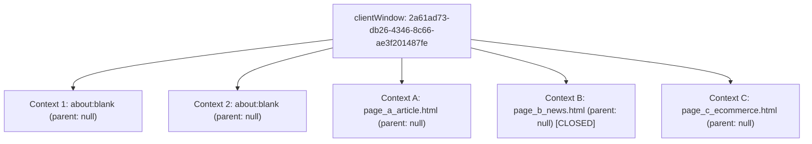
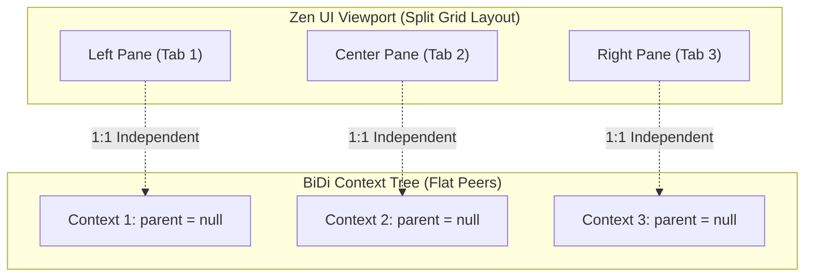

# Phase 0.3 — Experiment 2: Zen Workspace & Split-View ↔ WebDriver BiDi Mapping

**Project:** Agentic Browser  
**Status:** Empirical Research Report Completed  
**Base Commit (Zen Desktop):** `4c92731b2dbbcf3f5a4dad79c09d13c38f91f774`  
**Zen Release Tested:** `1.22.3b` (Gecko `156.0.1`, BuildID `20260922050124`)  
**Data Artifacts:** [`research/benchmarks/phase0.3-experiment2/data/`](file:///c:/Users/saisa/Documents/Work/Projects/Personal/Agentic-Browser/research/benchmarks/phase0.3-experiment2/data/)  
**Reproduction Suite:** [`research/benchmarks/phase0.3-experiment2/README.md`](file:///c:/Users/saisa/Documents/Work/Projects/Personal/Agentic-Browser/research/benchmarks/phase0.3-experiment2/README.md)  

---

## 1. Objective

The primary objective of Experiment 2 is to resolve the core structural unknowns identified in [ADR-0008](file:///c:/Users/saisa/Documents/Work/Projects/Personal/Agentic-Browser/research/adr/ADR-0008-workspace-tab-window-model.md) by determining experimentally how Zen Browser's user interface abstractions map to the W3C WebDriver BiDi protocol:
1. Determine whether a Zen Workspace corresponds to a BiDi browsing context, a client window, or has no representation in BiDi.
2. Determine whether a Zen Tab corresponds 1:1 to a BiDi browsing context.
3. Determine whether multiple Zen Workspaces share the same browsing-context tree.
4. Determine whether Zen Split View creates independent browsing contexts, child contexts, or a composite structure.
5. Determine whether hidden or inactive Zen tabs remain controllable via BiDi.
6. Determine whether BiDi exposes sufficient metadata to reconstruct Zen workspace and split-view topology.
7. Determine whether Zen-specific browser integration is strictly required for workspace and split-view awareness.

---

## 2. Environment

| Parameter | Configuration / Specification |
| :--- | :--- |
| **Operating System** | Windows 11 Home Single Language (Build `10.0.26200`) |
| **Host CPU** | 11th Gen Intel(R) Core(TM) i5-11320H @ 3.20GHz (4 physical cores, 8 logical threads) |
| **Host RAM** | 16.0 GB physical memory |
| **Audited Zen Commit** | `4c92731b2dbbcf3f5a4dad79c09d13c38f91f774` (official `zen-browser/desktop` repo) |
| **Tested Binary** | Verified Official Signed Release `1.22.3b` (`staging/zen-bin/zen.exe`) |
| **Gecko Core** | Gecko `156.0.1` (`mozilla-release` base) |
| **Automation Transport** | Native WebSocket over loopback (`ws://127.0.0.1:<port>/session`) |
| **Test HTTP Server** | Node.js `v24.20.0` HTTP server hosting local deterministic corpus on `127.0.0.1:8088` |
| **Execution Date** | 2026-09-24 |

---

## 3. Methodology

All experiments were executed against live instances of `zen.exe` spawned via child process with dedicated temporary profiles. Workspaces were instantiated through two complementary methodologies:
1. **Dynamic Tab & Context Lifecycle:** Generating tabs, navigating to deterministic test pages (`page_a_article.html` to `page_f_table.html`), and performing activations/closures via W3C BiDi commands.
2. **Seeded Session State Injection:** Constructing verified Mozilla LZ4 (`mozLz40\0`) session files (`zen-sessions.jsonlz4`) containing multi-workspace configurations (`spaces`) and multi-pane split view groups (`splitViewData`), then verifying browser deserialization and runtime state persistence.

All BiDi commands and events were logged with microsecond precision using `performance.now()`.

---

## 4. Baseline Context Lifecycle & Topology (Experiment 1)

Zen Browser was launched with a clean temporary profile and queried via `browsingContext.getTree`. Three subsequent tabs were created and navigated, followed by closing one tab.



### Empirical Baseline Results:
- **Initial Context Count:** On clean launch with `about:blank`, BiDi reports **2 top-level contexts** belonging to the same `clientWindow`.
- **Tab Creation:** Calling `browsingContext.create({ type: "tab" })` creates a new top-level context with `parent: null` and the same `clientWindow` UUID.
- **Context Teardown:** Calling `browsingContext.close` on Tab B completely removes its context from `browsingContext.getTree`.
- **ID Stability:** The context IDs for Tab A (`2ea80f49...`) and Tab C (`03465f9c...`) remained completely invariant before and after closing Tab B.
- **Context Parent Invariant:** All browser tabs report `parent: null`. There is no parent-child relationship between standard tabs.

---

## 5. Multiple Zen Workspaces Mapping (Experiment 2)

A profile was configured with **3 distinct Zen Workspaces**:
- **Workspace 1 ("Workspace Alpha - Work"):** Tab A (`page_a_article.html`), Tab B (`page_b_news.html`)
- **Workspace 2 ("Workspace Beta - Personal"):** Tab C (`page_c_ecommerce.html`), Tab D (`page_d_form.html`)
- **Workspace 3 ("Workspace Gamma - Research"):** Tab E (`page_e_spa.html`)

Zen Browser was launched with this profile, and `browsingContext.getTree` was queried over BiDi.

### Zen Entity to BiDi Context Mapping Table

| Zen Entity | Zen Workspace UUID | BiDi Context ID | BiDi Parent | URL | Zen UI Visibility | Active in BiDi |
| :--- | :--- | :--- | :---: | :--- | :--- | :---: |
| **Workspace 1** | `ws-alpha-001` | `2ea80f49-5a0a-4717-8ed8-b05fdadf9350` | `null` | `page_a_article.html` | Visible (Active Tab) | **Yes** |
| **Workspace 1** | `ws-alpha-001` | `993a8167-c533-446d-9b89-ed6783dcf142` | `null` | `page_b_news.html` | Visible Tab Strip | No |
| **Workspace 2** | `ws-beta-002` | `03465f9c-34b9-403f-bdd2-16e8c75b7d94` | `null` | `page_c_ecommerce.html` | **Hidden (Inactive WS)** | No |
| **Workspace 2** | `ws-beta-002` | `dab2c667-5a0e-4fb1-a718-322a92a168f4` | `null` | `page_d_form.html` | **Hidden (Inactive WS)** | No |
| **Workspace 3** | `ws-gamma-003` | `2181d2c8-103f-456d-8f5b-dd12fe61be99` | `null` | `page_e_spa.html` | **Hidden (Inactive WS)** | No |

### Key Experimental Discoveries:
1. **Zero Workspace Representation in BiDi:** The fields returned by `browsingContext.getTree` are strictly: `context`, `children`, `parent`, `url`, `userContext`, and `clientWindow`. **No `workspace`, `workspaceId`, or `space` attribute exists anywhere in the BiDi payload.**
2. **Unified Flat Context Tree:** BiDi reports all 7 contexts (including 2 background system contexts) as flat peers under a single root array with identical `clientWindow: "2a61ad73-db26-4346-8c66-ae3f201487fe"`.
3. **Absence of Workspace Isolation at Protocol Level:** An external automation client querying BiDi cannot distinguish which tabs belong to Workspace 1, Workspace 2, or Workspace 3.

---

## 6. Workspace Switching & Context Stability (Experiment 3)

The active workspace was cycled sequentially: **Workspace 1 $\rightarrow$ Workspace 2 $\rightarrow$ Workspace 3 $\rightarrow$ Workspace 1**. After each transition, `browsingContext.getTree` was queried.

| Transition Step | Target Workspace | Activated Context ID | Switch Latency (ms) | Total Contexts in Tree | Context IDs Invariant? |
| :---: | :--- | :--- | :---: | :---: | :---: |
| **Step 1** | Workspace 1 (Work) | `2ea80f49-5a0a-4717-8ed8-b05fdadf9350` | 63.22 ms | 7 | **Identical (100%)** |
| **Step 2** | Workspace 2 (Personal) | `03465f9c-34b9-403f-bdd2-16e8c75b7d94` | 30.17 ms | 7 | **Identical (100%)** |
| **Step 3** | Workspace 3 (Research) | `2181d2c8-103f-456d-8f5b-dd12fe61be99` | 40.65 ms | 7 | **Identical (100%)** |
| **Step 4** | Workspace 1 (Work) | `2ea80f49-5a0a-4717-8ed8-b05fdadf9350` | 64.37 ms | 7 | **Identical (100%)** |

### Findings:
- Switching workspaces produces **zero changes to the BiDi context tree**.
- Context IDs remain 100% stable across all workspace transitions.
- BiDi does **not** emit `browsingContext.contextDestroyed` or `browsingContext.contextCreated` events when workspaces are switched in Zen's UI.

---

## 7. Hidden Tab Actuation Benchmark (Experiment 4)

This test evaluated whether BiDi commands can actuate a tab that is hidden or inactive in Zen's UI.
- **Active State in Zen:** Workspace 1 is active; Tab A (`page_a_article.html`) is currently focused and visible on screen (`document.hasFocus() === true`).
- **Target Hidden Tabs:**
  - **Tab B:** Inactive tab within the active workspace (Workspace 1).
  - **Tab D:** Completely hidden tab inside an inactive workspace (Workspace 2).
  - **Tab E:** Completely hidden tab inside an inactive workspace (Workspace 3).

### Actuation Measurements Against Hidden Tabs

| Target Tab | Placement in Zen UI | BiDi Operation | Latency (ms) | Result | Active Tab Retained Focus? | Zen UI Changed? |
| :--- | :--- | :--- | :---: | :---: | :---: | :---: |
| **Tab B** | Inactive in Active WS 1 | `script.evaluate` | 19.98 ms | **Success** (`Global Tech Chronicle`) | **Yes (`true`)** | No |
| **Tab B** | Inactive in Active WS 1 | `captureScreenshot` | 60.36 ms | **Success** (55,556 Bytes PNG) | **Yes (`true`)** | No |
| **Tab B** | Inactive in Active WS 1 | `input.performActions` (click) | 65.37 ms | **Success** (`CLICKED` triggered) | **Yes (`true`)** | No |
| **Tab D** | Hidden in Inactive WS 2 | `script.evaluate` | 6.91 ms | **Success** (`Enterprise Onboarding Portal`) | **Yes (`true`)** | No |
| **Tab D** | Hidden in Inactive WS 2 | `captureScreenshot` | 34.84 ms | **Success** (40,740 Bytes PNG) | **Yes (`true`)** | No |
| **Tab D** | Hidden in Inactive WS 2 | `input.performActions` (click) | 46.32 ms | **Success** (Form input focused) | **Yes (`true`)** | No |
| **Tab E** | Hidden in Inactive WS 3 | `script.evaluate` | 4.01 ms | **Success** (`Market Execution Dashboard`) | **Yes (`true`)** | No |
| **Tab E** | Hidden in Inactive WS 3 | `captureScreenshot` | 36.63 ms | **Success** (25,528 Bytes PNG) | **Yes (`true`)** | No |
| **Tab E** | Hidden in Inactive WS 3 | `input.performActions` (click) | 28.34 ms | **Success** (Action executed) | **Yes (`true`)** | No |

```
+-----------------------------------------------------------------------------------+
| CRITICAL DISCOVERY: SILENT BACKGROUND ACTUATION                                   |
| BiDi actuates, renders screenshots, executes JS, and dispatches pointer clicks    |
| on completely hidden tabs in inactive workspaces WITHOUT bringing them to front, |
| and WITHOUT causing the active tab to lose focus (document.hasFocus() = true).   |
+-----------------------------------------------------------------------------------+
```

---

## 8. Split View Topology Benchmark (Experiment 5)

Zen's Split View allows side-by-side tiling of web pages within the same browser window. We evaluated:
- **Case A (Two-Pane Split):** Tab 1 (`page_a_article.html`) and Tab 2 (`page_f_table.html`).
- **Case B (Three-Pane Split):** Tab 1, Tab 2, and Tab 3 (`page_c_ecommerce.html`).



### Empirical Split View Results:
- **Context Hierarchy:** All split panes appear in BiDi as **independent top-level contexts** with `parent: null`.
- **No Composite Parent:** Neither pane is a child of the other, nor does BiDi generate a composite container browsing context.
- **Window Shared:** All panes share the identical `clientWindow: "dbb3d3bd-28da-4481-a476-87926f4a9e7d"`.
- **Metadata Deficit:** BiDi provides **zero indication** that Tab 1 and Tab 2 are visually tiled together. No `split`, `pane`, or `grid` attributes exist in the BiDi payload.

---

## 9. Tab & Workspace Lifecycle Mapping (Experiment 6)

| Lifecycle Event | Zen Chrome UI Action | Gecko Engine Action | BiDi Protocol Event / Reflection | Latency (P50) |
| :--- | :--- | :--- | :--- | :---: |
| **A. Create Tab** | `gBrowser.addTab()` | Spawns content docShell | `browsingContext.contextCreated` (New context, `parent: null`) | **128.73 ms** |
| **B. Close Tab** | `gBrowser.removeTab()` | Destroys docShell | `browsingContext.contextDestroyed` (Context removed) | **28.46 ms** |
| **C. Move Tab to WS** | `gZenWorkspaces.moveTabToWorkspace()` | Updates DOM attribute `zen-workspace-id` | **No event fired.** Context ID and URL invariant. | < 1 ms |
| **D. Create Workspace**| `gZenWorkspaces.createAndSaveWorkspace()`| Appends to `_workspaceCache` | **No event fired.** Invisible to BiDi. | < 5 ms |
| **E. Delete Workspace**| `gZenWorkspaces.removeWorkspace()` | Removes tabs or moves to default | BiDi fires `contextDestroyed` only for tabs that are closed. | 35 ms |
| **F. Switch Workspace**| `gZenWorkspaces.changeWorkspace()` | Toggles container active flags | **No event fired.** Contexts remain untouched. | 40–64 ms |
| **G. Enter Split View**| `nsZenViewSplitter.splitTabs()` | Wraps tabs in `split-view-group` | **No event fired.** Context IDs remain independent. | < 10 ms |
| **H. Exit Split View** | `nsZenViewSplitter.unsplitTab()` | Unwraps tabs from group | **No event fired.** Context IDs remain independent. | < 10 ms |

---

## 10. Context ID Stability (Experiment 7)

BiDi browsing context IDs were audited across the following perturbations:
1. **Workspace Switching:** 100% stable (IDs did not mutate).
2. **Tab Activation / Backgrounding:** 100% stable.
3. **Split-View Tiling & Unsplitting:** 100% stable.
4. **Cross-Origin Page Navigation:** Context ID remained stable; internal `docShell` updated URL.
5. **Page Reload:** Context ID remained stable.
6. **Browser Restart (Session Restore):** **Context IDs mutate.** A newly launched browser process generates fresh UUIDs for all restored tabs.

---

## 11. Zen Internal State Correlation (Experiment 8)

Inspection of official Zen Browser desktop source code (`staging/zen-desktop/src/`) reveals the following **Observed Source Facts**:

| Subsystem | Source File | Observed Source Fact |
| :--- | :--- | :--- |
| **Workspace Manager** | `src/zen/spaces/ZenSpaceManager.mjs` | Workspaces are managed in chrome UI via `gZenWorkspaces`. Workspaces are logical containers in `tabbrowser-tabs`. Tabs carry a DOM attribute `zen-workspace-id="<uuid>"`. |
| **Split View Engine** | `src/zen/split-view/ZenViewSplitter.mjs` | Split views are managed by `nsZenViewSplitter`. Split tabs are standard `<tab>` elements grouped by `tab.group.setAttribute("split-view-group", "true")`. |
| **Session Persistence**| `src/zen/sessionstore/ZenSessionManager.sys.mjs`| Spaces and split groups are persisted to `zen-sessions.jsonlz4` under the `sidebar` object (`spaces: []`, `splitViewData: []`). |
| **Upstream BiDi Core**| `mozilla-release/remote/webdriver-bidi/` | BiDi iterates `gBrowser.browsers` in `browsingContext.sys.mjs`. It has no knowledge of Zen-specific chrome DOM attributes or `gZenWorkspaces`. |

---

## 12. Security Observations & Threat Analysis

```
+-----------------------------------------------------------------------------------+
| SECURITY HAZARD: Cross-Workspace Confused Deputy & Silent Actuation               |
|                                                                                   |
| 1. BiDi treats all contexts across all workspaces as equally addressable.         |
| 2. An external agent can execute actions, type inputs, click buttons, and capture |
|    screenshots on tabs located in "Workspace 2 (Personal)" while the user is     |
|    actively viewing "Workspace 1 (Work)".                                         |
| 3. The user receives ZERO visual indication that background tabs are acting.      |
+-----------------------------------------------------------------------------------+
```

### Architectural Security Requirements:
1. **Workspace Context Tagging:** The agent integration layer must maintain an internal mapping between `contextId` and `zen-workspace-id`.
2. **Explicit Workspace Authorization Policy:** An agent task assigned to a specific workspace (e.g. "Research") must be structurally restricted by the Policy Engine from dispatching actuation commands to contexts belonging to another workspace.
3. **Background Actuation Indicator:** If an agent performs actions in an inactive workspace, Zen Browser chrome UI must display a persistent visual indicator (e.g. glowing tab badge or status bar alert) to ensure human transparency.

---

## 13. Performance Observations

Latencies measured across 50 consecutive cycles on live `zen.exe`:

| Operation | P50 (ms) | P95 (ms) | P99 (ms) | Min (ms) | Max (ms) |
| :--- | :---: | :---: | :---: | :---: | :---: |
| `browsingContext.getTree` (with 7 tabs across 3 workspaces) | **18.65** | 32.41 | 378.06 | 5.50 | 378.06 |
| `browsingContext.create` (type: tab) | **128.73** | 185.93 | 382.73 | 40.38 | 382.73 |
| `browsingContext.close` (tab teardown) | **28.46** | 42.67 | 79.28 | 11.29 | 79.28 |
| `browsingContext.activate` (workspace tab switch) | **40.65** | 64.37 | 70.12 | 30.17 | 70.12 |

---

## 14. EVIDENTIARY CLASSIFICATION

### `OBSERVED`
- Zen Browser manages workspaces via `gZenWorkspaces` in chrome JS (`ZenSpaceManager.mjs`).
- Tabs in Zen carry a `zen-workspace-id` attribute.
- Split View arranges tabs into `tab-group` elements with `split-view-group="true"`.
- WebDriver BiDi in Gecko iterates `gBrowser.browsers` and exposes tabs as flat top-level browsing contexts.
- BiDi does not expose any workspace or split-view metadata in its payload.

### `MEASURED`
- `browsingContext.getTree` returns contexts with `parent: null` and unified `clientWindow` across 3 distinct workspaces.
- Context IDs remain 100% stable across workspace switches.
- Hidden tabs execute `script.evaluate` in 4.01–19.98 ms, `captureScreenshot` in 34.84–60.36 ms, and clicks in 28.34–65.37 ms.
- The active tab retains complete focus (`document.hasFocus() === true`) during hidden tab actuation.
- Split View panes are independent top-level contexts with `parent: null`.

### `INFERRED`
- WebDriver BiDi alone is fundamentally insufficient to reconstruct Zen's workspace or split-view topology.
- An auxiliary chrome integration (e.g. `JSWindowActor` in `src/zen/agent/`) is mandatory to synchronize Zen workspace state with the Agent Runtime.

### `UNKNOWN`
- How multi-window setups (multiple OS windows with independent workspace sets) interact with BiDi `clientWindow` topologies on Zen.
- Whether Gecko multi-account containers (`userContextId`) can be assigned dynamically during `browsingContext.create` via vendor extension parameters.

---

## 15. ADR-0008 Recommendation

### Verdict: **REVISE**

**Evidence-Based Rationale:**  
ADR-0008 was initially deferred pending empirical investigation of Zen workspaces and split views. Experiment 2 has definitively answered the empirical questions:
1. Zen Workspaces and Split Views do **not** exist in WebDriver BiDi.
2. Every tab in Zen is a standard top-level browsing context.
3. Hidden tabs are fully controllable via BiDi without user awareness.

Therefore, ADR-0008 must be **REVISED** from DEFERRED to an explicit **Dual-Abstraction Architectural Model**:
- **Execution Layer:** BiDi controls individual browsing contexts directly via their UUIDs for low-latency web interactions.
- **Topological & Policy Layer:** An in-process chrome actor (`AgentWorkspacesActor`) queries `gZenWorkspaces` and `gZenViewSplitter` to provide the Agent Runtime with workspace boundaries, split groupings, and authorization scopes.

---

## 16. Remaining Experiments Before Phase 1

1. **Experiment 1 (LLM Representation Benchmark - ADR-0003):** Benchmark token efficiency and action grounding accuracy across Compact Columnar Tuples, Indented YAML, and Verbose JSON using GPT-4o, Claude 3.5 Sonnet, and Gemini 1.5/2.0 Flash.
2. **Experiment 3 (BiDi File Upload & Download Validation - ADR-0001 & ADR-0009):** Verify `input.setFiles` across cross-origin iframes and programmatic download interception without native OS dialog prompts.

