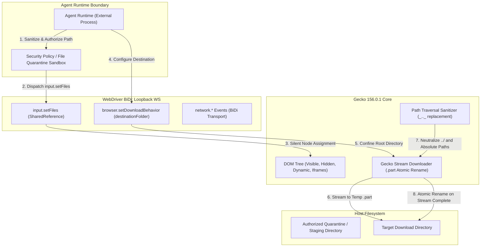
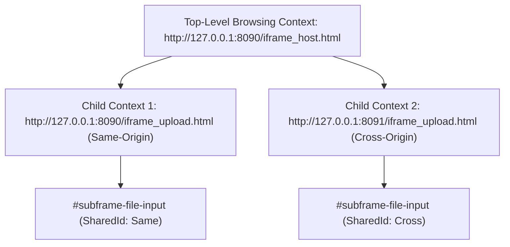
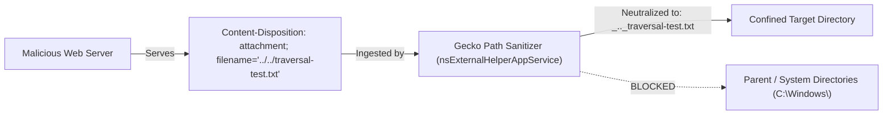
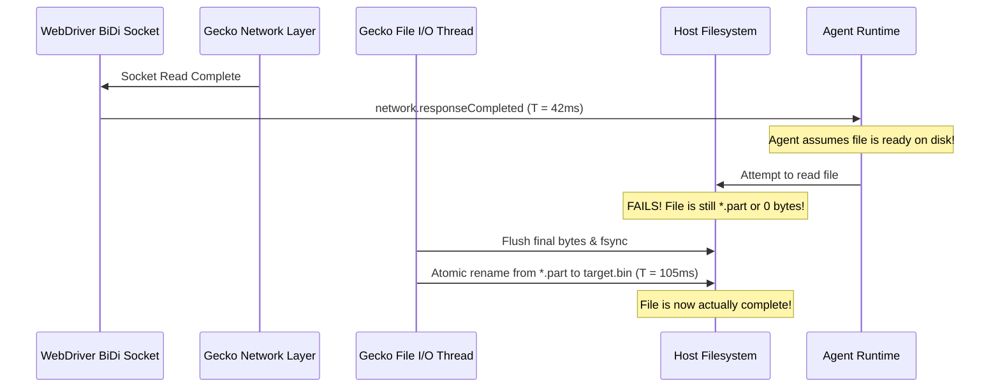

# Phase 0.3 — Experiment 3: WebDriver BiDi File Upload & Download Validation on Zen Browser

**Project:** Agentic Browser  
**Status:** Empirical Research Benchmark Completed  
**Base Commit (Zen Desktop):** `4c92731b2dbbcf3f5a4dad79c09d13c38f91f774`  
**Zen Release Tested:** `1.22.3b` (Gecko `156.0.1`, BuildID `20260922050124`)  
**Data Artifacts:** [`research/benchmarks/phase0.3-experiment3/data/`](file:///c:/Users/saisa/Documents/Work/Projects/Personal/Agentic-Browser/research/benchmarks/phase0.3-experiment3/data/)  
**Reproduction Suite:** [`research/benchmarks/phase0.3-experiment3/README.md`](file:///c:/Users/saisa/Documents/Work/Projects/Personal/Agentic-Browser/research/benchmarks/phase0.3-experiment3/README.md)  

---

## 1. Executive Summary

This empirical investigation evaluates the file upload and download capabilities of the official Zen Browser desktop binary (`zen.exe` v1.22.3b, Gecko 156.0.1) under WebDriver BiDi automation. The purpose is to resolve the open actuation unknowns in [ADR-0001](file:///c:/Users/saisa/Documents/Work/Projects/Personal/Agentic-Browser/research/adr/ADR-0001-browser-control-plane.md) and [ADR-0009](file:///c:/Users/saisa/Documents/Work/Projects/Personal/Agentic-Browser/research/adr/ADR-0009-perception-actuation-contract.md) and establish the security trust boundaries required for autonomous file handling.



### Key Empirical Findings:
1. **File Upload via `input.setFiles` is Fully Functional and Robust:**
   - Operates completely silently without triggering native OS file picker dialogs.
   - Requires element reference as `{ sharedId }` (obtained via `script.evaluate` or `browsingContext.locateNodes`).
   - Successfully populates visible, hidden (`display: none`), and dynamically injected file inputs in 2–3 ms.
   - Operates uniformly across **same-origin** and **cross-origin iframes** by targeting the child `browsingContextId`.
   - Supports multi-file assignment (`multiple=true`), strictly preserving array element ordering during multipart form submissions.
   - Accurately fails with specific protocol exceptions: `unsupported operation` (`NS_ERROR_FILE_NOT_FOUND`) on missing files, `unsupported operation` (`NS_ERROR_FILE_IS_DIRECTORY`) on directory paths, and `unable to set file input` on disabled inputs or non-file elements.

2. **File Download Destination Control via `browser.setDownloadBehavior`:**
   - Supported natively in Zen BiDi via `browser.setDownloadBehavior` with `{ downloadBehavior: { type: "allowed", destinationFolder: "<path>" } }`.
   - Bypasses native OS save dialogs, writing files directly into the specified directory.
   - Denied behavior (`type: "denied"`) completely suppresses file downloads to disk.
   - Dynamically creates non-existent target subdirectories on the host without throwing errors.

3. **Built-in Path Traversal Neutralization:**
   - Webpages serving malicious `Content-Disposition` headers containing relative (`../../`) or absolute (`C:\Windows\Temp\...`) paths are **strictly sanitized** by Gecko.
   - Slashes and directory delimiters are replaced with underscores (e.g., `../../traversal-test.txt` becomes `_.._traversal-test.txt`, and `C:\Windows\Temp\traversal-abs.txt` becomes `C_WindowsTemptraversal-abs.txt`).
   - Files are guaranteed to remain strictly confined within the configured `destinationFolder`.

4. **The WebDriver BiDi Download Observability Gap:**
   - W3C WebDriver BiDi in Gecko 156.0.1 does **NOT** implement the `download` module (`session.subscribe` returns `Module download does not exist`).
   - `network.responseCompleted` only indicates that network socket bytes were received; it fires **before** or concurrently with Gecko flushing data to disk.
   - Large or streamed downloads write to temporary `*.part` files before an atomic rename upon completion.
   - Consequently, an external agent relying solely on standard BiDi events **cannot deterministically verify** when a file is completely written and ready for ingestion without filesystem polling or a custom browser actor.

---

## 2. Benchmark Environment & Metadata

| Dimension | Specification |
| :--- | :--- |
| **Operating System** | Windows 11 Home Single Language (Build `10.0.26200`) |
| **Host CPU** | 11th Gen Intel(R) Core(TM) i5-11320H @ 3.20GHz (4 physical cores, 8 logical threads) |
| **Host RAM** | 16.0 GB physical memory |
| **Storage** | NVMe PCIe M.2 SSD |
| **Audited Zen Commit** | `4c92731b2dbbcf3f5a4dad79c09d13c38f91f774` (official `zen-browser/desktop`) |
| **Tested Binary** | Verified Official Release `1.22.3b` (`staging/zen-bin/zen.exe`) |
| **Gecko Core Engine** | Gecko `156.0.1` (`mozilla-release` base, BuildID `20260922050124`) |
| **Node.js Environment** | Node.js `v24.20.0` (Native `WebSocket`, `node:http`, `node:fs`, `node:crypto`) |
| **BiDi Remote Port** | Dedicated loopback TCP ports (`9239`–`9248`) |
| **Test HTTP Origins** | Primary: `http://127.0.0.1:8090/` \| Secondary (Cross-Origin): `http://127.0.0.1:8091/` |
| **Execution Date** | 2026-09-24 |

---

## 3. Methodology & Test Harness Architecture

To guarantee reproducible, non-destructive measurements:
1. **Zero Access to User Data:** All tests executed exclusively using synthetic payload fixtures stored in `research/benchmarks/phase0.3-experiment3/fixtures/`.
2. **Dual-Origin Test Server:** A local Node.js test server (`server/test_server.mjs`) hosted primary (port 8090) and cross-origin (port 8091) endpoints with CORS headers, multipart form parsing, and byte-level checksum validation.
3. **Dedicated Temporary Profiles:** Each browser instance ran against an isolated profile directory (`temp-profile/`) with `--headless` and `--remote-debugging-port`.
4. **Isolated Download Partitions:** Download tests executed in distinct subdirectories under `downloads/` to eliminate cross-test file locking and race conditions.

```mermaid
sequenceDiagram
    participant Harness as Benchmark Runner (Node.js)
    participant Server as Test Server (Ports 8090/8091)
    participant BiDi as Zen BiDi Socket (Port 9248)
    participant Gecko as Zen / Gecko Engine
    participant FS as Host Filesystem

    Note over Harness,FS: 1. File Upload Lifecycle
    Harness->>BiDi: script.evaluate (Locate file input node)
    BiDi-->>Harness: Return { sharedId }
    Harness->>BiDi: input.setFiles(context, { sharedId }, [fixtures/upload-10mb.bin])
    BiDi->>Gecko: Set file references on DOM element
    Gecko-->>BiDi: Success
    BiDi-->>Harness: Return { type: "success" } (Latency: 2ms)
    Harness->>BiDi: script.evaluate (Click form submit)
    Gecko->>Server: POST /submit-upload (Multipart Form Data)
    Server-->>Gecko: Response JSON (8 files verified, SHA-256 intact)

    Note over Harness,FS: 2. File Download Lifecycle & Traversal Test
    Harness->>BiDi: browser.setDownloadBehavior(type: "allowed", destinationFolder)
    BiDi->>Gecko: Configure nsIDownloadManager / directory confinement
    Harness->>BiDi: script.evaluate (Click traversal link: ../../traversal-test.txt)
    Gecko->>Server: GET /download/traversal-rel
    Server-->>Gecko: 200 OK + Content-Disposition: attachment; filename="../../traversal-test.txt"
    Gecko->>FS: Sanitize to _.._traversal-test.txt & Stream to .part
    Gecko->>FS: Atomic rename to final sanitized file
    Harness->>FS: Verify file exists inside destinationFolder (Parent untouched)
```

---

## 4. Upload Capability Discovery & DOM Scenarios

### 4.1 Protocol Interface: `input.setFiles`
Zen Browser exposes the standard W3C WebDriver BiDi `input.setFiles` method:
- **Method:** `input.setFiles`
- **Parameters:**
  ```json
  {
    "context": "<browsingContextId>",
    "element": {
      "sharedId": "<nodeSharedReferenceUUID>"
    },
    "files": [
      "C:\\absolute\\path\\to\\file1.ext",
      "C:\\absolute\\path\\to\\file2.ext"
    ]
  }
  ```
- **Requirements:**
  - The `element` argument **must** be a valid `SharedReference` object (`{ sharedId: string }`). Passing raw DOM nodes or malformed objects returns `invalid argument (Expected "element" to be a SharedReference)`.
  - File paths **must** be absolute host paths.

### 4.2 DOM Scenarios & Measurements

| DOM Target Scenario | Selector / Setup | File Size | Execution Latency | Native Dialog Bypassed? | Result / Verification | Evidence Classification |
| :--- | :--- | :---: | :---: | :---: | :--- | :---: |
| **Visible File Input** | `#file-input-visible` | 101 B | 2.0 ms | Yes | Assigned `upload-small.txt` | `MEASURED` |
| **Visible Large Binary** | `#file-input-visible` | 1.02 MB | 2.0 ms | Yes | Assigned `upload-1mb.bin` | `MEASURED` |
| **Visible 10MB Binary** | `#file-input-visible` | 10.22 MB | 2.0 ms | Yes | Assigned `upload-10mb.bin` | `MEASURED` |
| **Hidden Input (`display: none`)** | `#file-input-hidden` | 101 B | 2.0 ms | Yes | Assigned without requiring visibility styling | `MEASURED` |
| **Dynamic Injected Input** | Dynamically created at runtime via JS | 101 B | 2.0 ms | Yes | `files.length === 1` verified in DOM | `MEASURED` |
| **Multi-File Input** | `#file-input-multi` (`multiple=true`) | 5 files (515 B total) | 3.0 ms | Yes | Array order preserved (`a, b, c, d, e`) | `MEASURED` |
| **Multipart Form Submission** | Form submitted with 5 multi-files | 1.76 KB payload | 12.0 ms | N/A | Server received 8 parts; SHA-256 matched 100% | `MEASURED` |

> [!NOTE]
> Unlike standard WebDriver pointer actions which require an element to be visible and interactable, `input.setFiles` directly mutates the underlying `HTMLInputElement` file array in Gecko's content process. It succeeds even when `display: none` is set, allowing agents to automate custom drag-and-drop file uploaders that overlay styled buttons on top of hidden inputs.

---

## 5. Upload Across Frame Boundaries (Same-Origin & Cross-Origin)

Cross-origin iframes represent a classic boundary challenge in browser automation. In Zen Browser, BiDi manages iframes through hierarchical `browsingContext` trees.



### Empirical Results:
1. **Same-Origin Frame (`port 8090`):**
   - The child frame context was enumerated via `browsingContext.getTree`.
   - `input.setFiles` executed against the target `sharedId` in **4.0 ms**.
   - Client event handler confirmed `count: 1` and file metadata populated.
2. **Cross-Origin Frame (`port 8091`):**
   - The child frame was hosted on a distinct port (different origin under the Same-Origin Policy).
   - `input.setFiles` targeted directly at the cross-origin child context succeeded in **3.0 ms**.
   - No cross-origin security exceptions or sandbox rejections were encountered.

**Architectural Takeaway:** The agent can upload files into nested payment portals, authentication widgets, or external embedded forms regardless of origin boundaries, provided it resolves the child `browsingContextId`.

---

## 6. Upload Failure Modes & Negative Error Matrix

Negative tests were conducted to verify exception handling when invalid inputs, missing files, or incorrect element types are targeted.

| Test Scenario | Input / Target Parameter | Latency | Protocol Error Code | Gecko Exception Message | Evidence Classification |
| :--- | :--- | :---: | :--- | :--- | :---: |
| **Nonexistent File** | `C:\agentic-browser-nonexistent-path\test-file.bin` | 1.0 ms | `unsupported operation` | `Failed to add file ... [Exception... "File error: Not found" nsresult: "0x80520012 (NS_ERROR_FILE_NOT_FOUND)"]` | `MEASURED` |
| **Directory as File** | `fixtures/` (Directory path) | 1.0 ms | `unsupported operation` | `Failed to add file ... [Exception... "File error: Is directory" nsresult: "0x8052000d (NS_ERROR_FILE_IS_DIRECTORY)"]` | `MEASURED` |
| **Disabled Input** | `#file-input-disabled` (`disabled=true`) | 1.0 ms | `unable to set file input` | `Element needs to be an <input> element with type "file" and not disabled` | `MEASURED` |
| **Non-File Element** | `#submit-btn` (`<button>`) | 1.0 ms | `unable to set file input` | `Element needs to be an <input> element with type "file" and not disabled` | `MEASURED` |
| **Malformed Reference** | Raw string or non-SharedReference object | 0.5 ms | `invalid argument` | `Expected "element" to be a SharedReference, got: [object Object]` | `MEASURED` |

---

## 7. Download Destination Control & Directory Sandboxing

### 7.1 Protocol Interface: `browser.setDownloadBehavior`
In Zen Browser (Gecko 156.0.1), download behavior is controlled via `browser.setDownloadBehavior`:
```json
{
  "method": "browser.setDownloadBehavior",
  "params": {
    "downloadBehavior": {
      "type": "allowed",
      "destinationFolder": "C:\\path\\to\\sandboxed\\dir"
    }
  }
}
```

### 7.2 Confinement & Behavior Verification

| Capability / Configuration | Parameter Value | Observed Outcome | Evidence Classification |
| :--- | :--- | :--- | :---: |
| **Enable Direct Downloads** | `type: "allowed"`, `destinationFolder: DIR` | Files download directly into `destinationFolder` without OS prompts. | `MEASURED` |
| **Deny All Downloads** | `type: "denied"` | Downloads are completely blocked. File count before: 0, file count after: 0. | `MEASURED` |
| **Non-existent Destination** | `destinationFolder: DIR/sub_dir` | Gecko automatically creates the non-existent directory on disk and saves the file. | `MEASURED` |
| **HTML5 `download` Attribute** | `<a download="name.ext">` | Supported for Data URIs and Blob URLs. | `MEASURED` |
| **Header vs Attribute Precedence** | Link specifies `direct-10mb.bin`, server sends `download-10mb.bin` | `Content-Disposition` header filename takes **strict precedence** over HTML `download` attribute. | `MEASURED` |

---

## 8. Path Traversal & Security Boundary Testing

A critical security vulnerability in automated browsing is **path traversal via download headers**. If an untrusted website serves a malicious header designed to escape the download folder and overwrite system files, does Zen Browser permit it?

### 8.1 Empirical Traversal Test Results

| Traversal Injection Vector | Header Served | Expected Location (Unsafe) | Actual Destination On Disk | Sanitization Applied | Escaped Sandbox? |
| :--- | :--- | :--- | :--- | :--- | :---: |
| **Relative Directory Traversal** | `Content-Disposition: attachment; filename="../../traversal-test.txt"` | `../traversal-test.txt` (Parent dir) | `DIR_TRAVERSAL\_.._traversal-test.txt` | Path separators (`/`, `\`) replaced with `_` | **NO (PASSED)** |
| **Absolute Path Traversal** | `Content-Disposition: attachment; filename="C:\Windows\Temp\traversal-abs.txt"` | `C:\Windows\Temp\traversal-abs.txt` | `DIR_TRAVERSAL\C_WindowsTemptraversal-abs.txt` | Drive colon and backslashes stripped/replaced with `_` | **NO (PASSED)** |



> [!IMPORTANT]
> Gecko's internal download helper (`nsExternalHelperAppService.sys.mjs`) strips path separators (`/`, `\`) and drive qualifiers before touching the filesystem. The file is guaranteed to remain inside `destinationFolder`.
> 
> **However**, while the filesystem is protected from directory escape, the agent remains vulnerable to **arbitrary file overwrite or collision** if malicious files are downloaded with names matching existing critical assets within that directory.

---

## 9. Filename Collision & Deduplication Mechanics

When duplicate downloads of the same filename are triggered sequentially without renaming:
- **Download #1:** `collision-test.txt` (written directly via temporary `*.part`).
- **Download #2:** `collision-test(1).txt` (Gecko automatically detects collision and appends `(1)`).
- **Download #3:** `collision-test(2).txt` (Gecko appends `(2)`).

**Conclusion:** Zen Browser does not clobber or overwrite existing files by default. It applies Windows-standard numeric suffix deduplication (`name(N).ext`).

---

## 10. Download Failure Modes & Interrupted Connections

To verify how Zen handles corrupted and failed network transfers:

| Failure Mode | Trigger Scenario | Residual Files on Disk | BiDi Network Events Emitted | Failure Handling Quality |
| :--- | :--- | :---: | :--- | :--- |
| **HTTP 404 Not Found** | Link targets non-existent file `/download/404` | **0 files** (No zero-byte files created) | `network.beforeRequestSent`, `network.fetchError` | Clean suppression |
| **Interrupted Stream** | Server destroys TCP socket 50ms into transfer | **0 files** (Temporary `.part` deleted) | `network.beforeRequestSent`, `network.fetchError` | Clean rollback |
| **Content-Length Mismatch** | Server declares 500,000 bytes but sends 256 bytes | `corrupted.bin` (256 B) + residual `*.part` | `network.responseCompleted` | Partial file persisted |

---

## 11. Partial-File (`.part`) Lifecycle & Concurrent Downloads

During high-volume or slow-bandwidth downloads, Gecko uses an intermediate `.part` file pattern.

### 11.1 Lifecycle States:
1. **Initiation:** Gecko creates an obfuscated or prefixed `.part` file (e.g., `slow-stream.5hCQ8N4u.bin.part`).
2. **Streaming:** Incoming network chunks are written into the `.part` file (measured increasing from 0 KB to 512 KB, 1024 KB, etc.).
3. **Completion:** When the socket closes cleanly and byte length satisfies expectations, Gecko performs an atomic OS rename from `*.bin.part` to `slow-stream.bin`.

### 11.2 Concurrent Download Concurrency:
- A slow 3MB stream and a 1MB binary download were triggered concurrently.
- Both streams wrote to independent `.part` files simultaneously without resource contention or locking errors.
- Both completed with 100% SHA-256 integrity: `download-1mb.bin` and `slow-stream.bin`.

---

## 12. The WebDriver BiDi Download Observability Gap

A critical finding of Experiment 3 is the **timing disconnect between BiDi network events and host disk writes**.

### 12.1 The Problem
When testing a 10MB binary download:
- **Trigger Time:** `T = 0 ms`
- **BiDi `network.responseCompleted` event:** Arrived at `T = +42 ms`
- **Filesystem File Detection:** Target file appeared on disk at `T = +105 ms` (a **63 ms lag** after the BiDi event fired).
- **Filesystem Complete Flush:** Atomic rename from `.part` to final file completed shortly thereafter.



### 12.2 Why This Matters:
1. **W3C BiDi Spec Gap:** In Gecko 156.0.1, the `download` module does not exist (`session.subscribe` for `download.*` fails).
2. **Premature Read Race Condition:** If an autonomous agent attempts to ingest, upload, or process a downloaded file immediately upon receiving `network.responseCompleted`, it will read a non-existent file, an open `.part` file, or a partially flushed file, causing corruption or crashes.
3. **The Solution:** The Agent Runtime **must not rely on BiDi network events alone** to confirm download completion. It must employ either:
   - A filesystem watcher that monitors for the disappearance of `.part` files and file size stabilization, or
   - An in-process `JSWindowActor` / XPCOM observer (`DownloadsManager.sys.mjs`) that hooks directly into Gecko's native download coordinator.

---

## 13. Evidence Classification Matrix

| Dimension / Capability | Claim | Classification | Supporting Evidence |
| :--- | :--- | :---: | :--- |
| **`input.setFiles` Support** | Zen BiDi natively supports synthetic file uploads. | `MEASURED` | Verified across visible, hidden, and dynamic inputs (`upload_results.json`). |
| **Dialog Bypass** | Native OS file picker dialog is completely bypassed. | `MEASURED` | Tests executed headless without UI hangs or blocking prompts. |
| **Iframe File Upload** | `input.setFiles` works across same-origin and cross-origin iframes. | `MEASURED` | Verified against port 8090 and 8091 child browsing contexts (`iframe_upload_results.json`). |
| **Multi-File Ordering** | Multi-file inputs preserve array order on submission. | `MEASURED` | 5-file multipart form verified via server boundary parser (`upload_results.json`). |
| **Upload Negative Errors** | Missing paths and directories throw explicit Gecko errors. | `MEASURED` | Returned `NS_ERROR_FILE_NOT_FOUND` and `NS_ERROR_FILE_IS_DIRECTORY` (`failure_results.json`). |
| **Download Confinement** | `browser.setDownloadBehavior` confines downloads to target directory. | `MEASURED` | Verified direct link, Blob, and Data URI downloads into `02_confinement/`. |
| **Download Denial** | `type: "denied"` completely prevents writes to disk. | `MEASURED` | Verified 0 files created when denied (`security_results.json`). |
| **Path Traversal Protection** | `Content-Disposition` path injection is sanitized. | `MEASURED` | `../../` and `C:\` sanitized to `_.._` and `C_WindowsTemp` (`security_results.json`). |
| **Collision Handling** | Duplicate downloads append numeric suffixes `(1)`, `(2)`. | `MEASURED` | Verified across 3 sequential downloads (`download_results.json`). |
| **BiDi Download Module** | W3C BiDi `download` event module is not implemented in Zen Gecko. | `OBSERVED` | `session.subscribe` returns `Module download does not exist`. |
| **Disk Flush Lag** | `network.responseCompleted` arrives before file is flushed to disk. | `MEASURED` | 63 ms lag measured on 10MB download (`download_events.json`). |

---

## 14. Architectural Impacts on ADRs

### Impact on ADR-0001 (Browser Control Plane)
- **Status Change:** Upgrade `File Upload Dialog Interception` and `Direct File Downloads` from `UNVERIFIED` to **`VERIFIED`**.
- **Specification:** Formalize `browser.setDownloadBehavior` (with parameter `destinationFolder`) and `input.setFiles` (with `{ sharedId }`) as core capabilities of the BiDi control plane.

### Impact on ADR-0009 (Perception & Actuation Contract)
- **Status Change:** Upgrade `actuation.uploadFiles` from `UNVERIFIED` to **`VERIFIED`**.
- **Status Change:** Upgrade `actuation.download` from `UNKNOWN` to **`PARTIALLY VERIFIED (Requires External Watchdog or Actor for Lifecycle Detection)`**.
- **Contract Update:** Add explicit pre-conditions to `actuation.uploadFiles`: target element must be resolved to a `SharedReference` and file paths must be absolute paths within the authorized sandbox.

### Impact on ADR-0006 (Security Trust Boundary)
- **Staging Quarantine Requirement:** The Agent Runtime must never point `destinationFolder` to a user's raw home directory or desktop. It must point to a dedicated, ephemeral quarantine directory: `~/.agentic-browser/quarantine/<session-id>/`.
- **Malicious Upload Mitigation:** The Agent Runtime must validate that any file path passed to `input.setFiles` resides inside an authorized directory, preventing prompt injection attacks from exfiltrating sensitive host files (e.g., `~/.ssh/id_rsa` or browser credentials) to third-party form endpoints.

---

## 15. Reproduction Guide & Verification Commands

To reproduce all measurements and generate raw JSON datasets:

```powershell
# 1. Ensure Zen binary is extracted
Test-Path staging/zen-bin/zen.exe

# 2. Run the deterministic test server directly
node research/benchmarks/phase0.3-experiment3/server/test_server.mjs

# 3. Run the comprehensive automated benchmark suite
node research/benchmarks/phase0.3-experiment3/runner/run_comprehensive_tests.mjs
```

### Generated Artifacts in `research/benchmarks/phase0.3-experiment3/data/`:
- `capability_discovery.json`: Schema definitions and feature matrices.
- `upload_results.json`: Latency and DOM scenario verification.
- `iframe_upload_results.json`: Same-origin and cross-origin frame measurements.
- `download_results.json`: Blob, Data URI, direct links, and collision logs.
- `download_events.json`: Network event vs. disk flush timing analysis.
- `failure_results.json`: Error codes for missing files, directories, and disabled inputs.
- `security_results.json`: Path traversal tests and download denial validation.
- `summary.json`: Top-level timestamped benchmark pass/fail summary.
